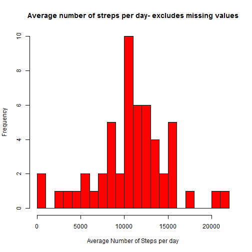
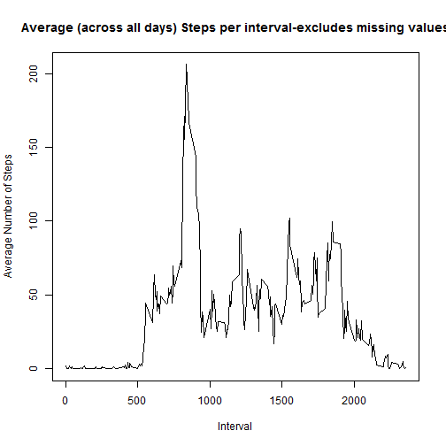
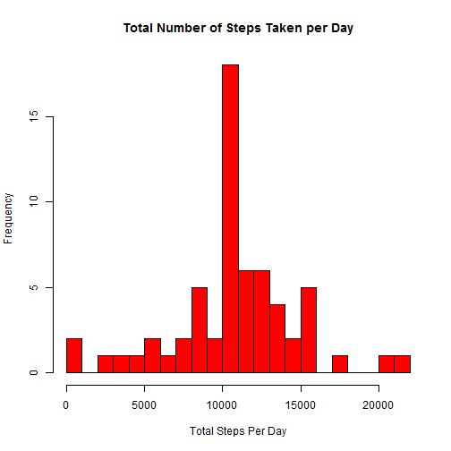
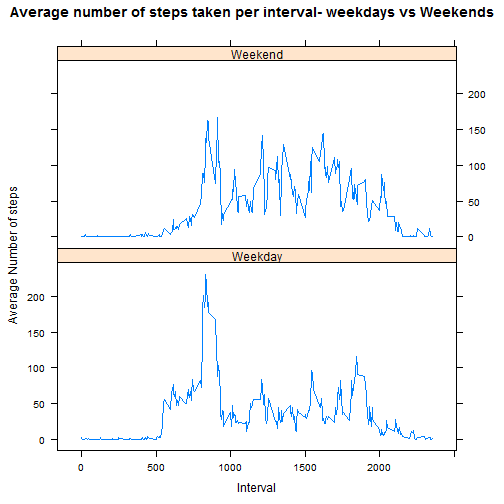

## Loading and preprocessing the data
Set-up the environment   
Load the required libraries & set WD


```r
    library("lattice")
    library(dplyr)
	  library(timeDate)
    library(data.table)
	  working.dir <- "E://Coursera//Data_Scientist//reproducable_research//peer_assessment//pa_one"
	  setwd(working.dir)
```

Load the data 
Assumption is that the data exists in the ./data directory in a raw (non archived form)


```r
	  activity.raw.data<-as.data.table(read.csv(".//data//activity.csv",header=TRUE))
```


## What is mean total number of steps taken per day?
Question 1: Exclusion missing values, What is mean total number of steps taken per day? 
Analysis excluding missing values.


```r
	#construct DT witout misisng values.
	  activity.raw.no.na<-filter(activity.raw.data,!is.na(steps))
	#Group by day.
	  activity.by.day.no.na <- group_by(activity.raw.no.na,date)
	  summary.steps.day<-summarize(activity.by.day.no.na,total_steps_per_day=sum(steps),median_steps_per_day=median(steps),average_steps_per_day=mean(steps))

		
	#Histogram
		hist(summary.steps.day$total_steps_per_day, breaks = 30,col = "red1",xlab="Average Number of Steps per day",main="Average number of streps per day- excludes missing values")
```

 

```r
print(paste0("Mean Steps per day: ",mean(summary.steps.day$average_steps_per_day))) 
```

```
## [1] "Mean Steps per day: 37.3825995807128"
```

```r
print(paste0("Median Steps per day: ",median(summary.steps.day$median_steps_per_day)))
```

```
## [1] "Median Steps per day: 0"
```

## What is the average daily activity pattern?
Question 2.1: Make a time series plot (i.e. type = "l") of the 5-minute interval (x-axis) and the average number of steps taken, averaged across all days (y-axis)


```r
		activity.by.interval.no.na <- group_by(activity.raw.no.na,interval)	
		summary.steps.period<-summarize(activity.by.interval.no.na,average_steps_per_interval=mean(steps))
		
	#Plot Time Series
		plot(summary.steps.period$interval,summary.steps.period$average_steps_per_interval, type = "l",ylab="Average Number of Steps",xlab="Interval", main="Average (across all days) Steps per interval-excludes missing values" ) 
```

 

Question 2.2: Which 5-minute interval, on average across all the days in the dataset, contains the maximum number of steps?


```r
	#Periods with Max Steps
		steps.period.desc <- arrange(summary.steps.period, desc(average_steps_per_interval))
		
	#print top interval 		
		print(paste0("The following five min interval contains the max number of steps: ",head(steps.period.desc,1)$interval))
```

```
## [1] "The following five min interval contains the max number of steps: 835"
```


## Inputing missing values
Question 3.1: Calculate and report the total number of missing values in the dataset (i.e. the total number of rows with NAs)


```r
		activity.raw.is.na<-filter(activity.raw.data,is.na(steps)) 
		print(paste0("The total number of misisng valuses is: ",count(activity.raw.is.na)$n))
```

```
## [1] "The total number of misisng valuses is: 2304"
```
Question 3.2: Devise a strategy for filling in all of the missing values in the dataset. The strategy does not need to be sophisticated. For example, you could use the mean/median for that day, or the mean for that 5-minute interval, etc..


```r
#Equivellent to an inner Join.
		activity.raw.replaced.na<-merge(activity.raw.is.na,summary.steps.period,by = "interval")
#Round the values
		activity.raw.replaced.na<-mutate(activity.raw.replaced.na,steps=round(average_steps_per_interval))
```
Question 3.3: Create a new dataset that is equal to the original dataset but with the missing data filled in.


```r
#Project the relevant attributes
		activity.raw.replaced.na<-select(activity.raw.replaced.na,interval,date,steps)
		activity.raw.final.no.na <- rbind(activity.raw.replaced.na,activity.raw.no.na)	
```
Question 3.4: Make a histogram of the total number of steps taken each day and Calculate and report the mean and median total number of steps taken per day. Do these values differ from the estimates from the first part of the assignment? What is the impact of imputing missing data on the estimates of the total daily number of steps?


```r
#Group by day.
		activity.by.day.final.no.na <- group_by(activity.raw.final.no.na,date)
		summary.steps.day.final.no.na<-summarize(activity.by.day.final.no.na,total_steps_per_day=sum(steps),median_steps_per_day=median(steps),average_steps_per_day=mean(steps))
	#Histogram
		hist(summary.steps.day.final.no.na$total_steps_per_day, breaks = 30,col = "red1",xlab="Total Steps Per Day",main="Total Number of Steps Taken per Day")
```

 

## Are there differences in activity patterns between weekdays and weekends?
Question 3.1: Create a new factor variable in the dataset with two levels - "weekday" and "weekend" indicating whether a given date is a weekday or weekend day.


```r
	###factor.weekend.raw.no.na<- mutate(activity.raw.final.no.na, is_weekend=isWeekend(as.Date(date)))
		factor.weekend.raw.no.na<- mutate(activity.raw.final.no.na, date=ifelse(isWeekend(as.Date(date)), 'Weekend', 'Weekday'))
	  factor.weekend.raw.no.na$date<-factor(factor.weekend.raw.no.na$date)
	  factor.weekend.raw.no.na<-mutate(factor.weekend.raw.no.na,date=(date))
```

Question 3.2: Make a panel plot containing a time series plot (i.e. type = "l") of the 5-minute interval (x-axis) and the average number of steps taken, averaged across all weekday days or weekend days (y-axis). See the README file in the GitHub repository to see an example of what this plot should look like using simulated data.


```r
  tst <- group_by(factor.weekend.raw.no.na,date,interval)
	weekend.summary.steps.interval<-summarize(tst,average_steps_per_day=mean(steps))
	
	xyplot(average_steps_per_day ~ interval| levels(weekend.summary.steps.interval$date),
           data = weekend.summary.steps.interval,
           type = "l",
           xlab = "Interval",
           ylab = "Average Number of steps",
	         main = "Average number of steps taken per interval- weekdays vs Weekends",
           layout=c(1,2))
```

 
